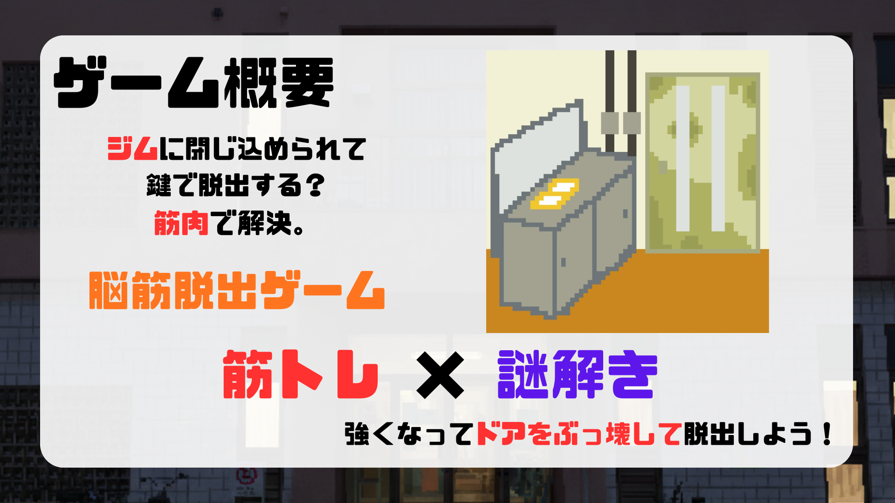
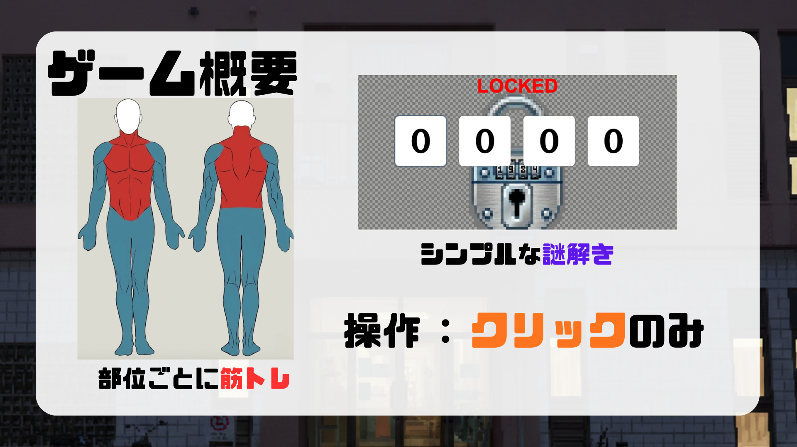

# EscapeFromGym - トレーニングセンターからの脱出

## 概要及び遊び方

「筋トレ × 謎解き」をテーマにした、2D脳筋脱出ゲームです。
プレイヤーは夜のトレーニングセンターに閉じ込められます。鍵を探すのではなく、部位ごとに筋トレを行って物理的にドアを破壊し、脱出を目指します。

* 操作: クリックのみ

## 動作環境
* Java Development Kit (JDK) がインストールされているPC

## 実行方法
git clone https://github.com/MuscleEscaper/EscapeFromGym.git

cd EscapeFromGym/EscapeFromGym

mkdir bin

javac -d bin src/*.java

java -cp bin EscapeGameOpening

## トラブルシューティング
Q. 画像が表示されない
A. コマンドを実行しているディレクトリが異なります。必ず `EscapeFromGym` ディレクトリの直下で実行してください。

## ライセンス
本プロジェクトは [MIT License](LICENSE) のもとで公開されています。

## アピールポイント
### 中村 (ディレクション / デベロップメント)
プロジェクトの進行管理およびシステムの基盤構築を担当。
詳細は [中村の技術的アピールポイントと実装詳細](./assets/docs/nakamura.md) をご参照ください。
