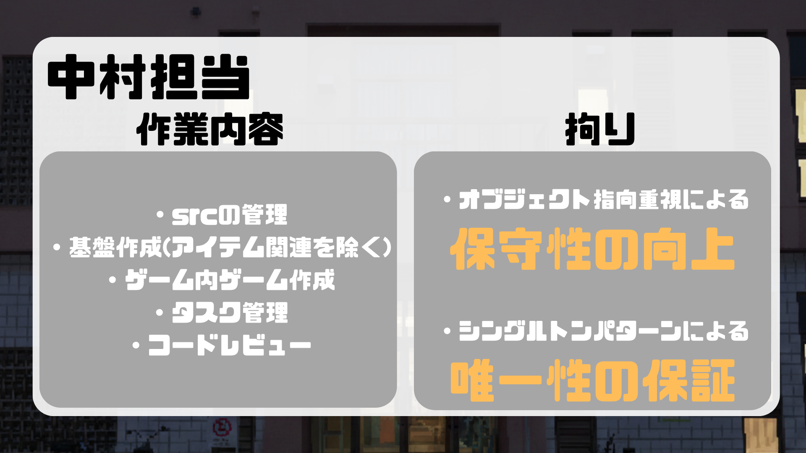
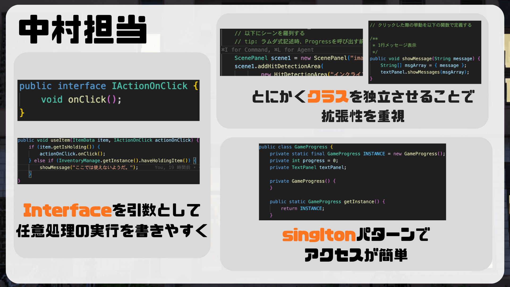

# 中村 榛 - 開発担当領域と技術的アピールポイント

## 1. 役割と担当業務

本プロジェクトにおいて、ディレクションおよびデベロップメント（Model, Controllerの基盤）を担当しました。主に以下の業務を遂行し、チーム全体の開発進行と技術基盤の構築を主導しています。

* プロジェクトのタスク管理とコードレビューの実施。
* `src`ディレクトリの全体管理、およびアイテム関連を除くシステム基盤・ゲーム内ゲームの実装。

## 2. アーキテクチャ設計と実装の工夫

開発において、オブジェクト指向を重視した設計を行い、コードの保守性と拡張性の向上に努めました。

### インターフェースを活用した疎結合な設計
各シーンにおけるクリック時の挙動を抽象化するため、`IActionOnClick` インターフェースを定義しました。これにより各クラスを独立させ、後からの機能追加や仕様変更に強い構造を実現しています。

```java
public interface IActionOnClick {
    void onClick();
}
```

## 3. 作成した主なコード一覧

システム全体の基盤となるロジックおよび状態管理を中心に、拡張性と保守性を考慮したオブジェクト指向設計を行いました。以下は担当した主要なクラス群です。

### アーキテクチャ基盤・ロジック制御
* **`IActionOnClick.java`**: クリック時の処理を抽象化する関数型インターフェース。ラムダ式を活用して具体的な処理を記述可能にし、UI要素と実行ロジックの結合を疎に保つ設計の中核を担っています。
* **`OnClickLogics.java`**: オブジェクトクリック時に発生するロジック（アイテム取得、進行状況の更新、ギミック解除など）を集約したクラス。入力検出や画面描画の責務からロジックを完全に分離しています。
* **`HitDetectionArea.java`**: 当たり判定（矩形領域）とクリック時処理を紐づけるクラス。アイテム使用時と通常クリック時でコンストラクタを分け、動的な処理の切り替えを可能にしています。

### 状態管理・進行制御（シングルトンパターン）
* **`GameProgress.java`**: ゲーム全体の進行度を一元管理するクラス。イベントの多重実行や順序破綻を防ぎ、任意のクラスから安全に進行状態を参照・更新できる設計です。
* **`PlayerStatus.java`**: プレイヤーの部位ごとの能力強化状態を管理するクラス。この状態モデルを参照することで、シーン側のイベント分岐を制御しています。

### アプリケーションコア・シーン管理
* **`EscapeGameApp.java` / `Scenes.java`**: エントリポイントおよび、全シーンの構成・アイテム配置・進行条件を一元的に定義する初期化クラス。設定を1箇所に集約することで、ゲームフローの拡張を容易にしました。

### UI・ビュー制御
* **`MainViewPanel.java`**: `JLayeredPane`と`CardLayout`を用い、背後のシーン、暗幕、テキストパネルの重ね合わせやシーン遷移を統括するレイヤ管理クラス。
* **`ScenePanel.java`**: 各シーンの背景描画と当たり判定領域を管理するパネル。動的な判定領域の追加・削除に対応しています。
* **`TextPanel.java`**: 独自タグを解釈してHTML変換を行うメッセージ表示パネル。暗幕表示とマウス入力の無効化を連動させています。
* **`ArrowButton.java`**: `JButton`の描画処理をオーバーライドし、状態（マウスオーバー等）に応じた色や透明度の変化を独自実装したカスタムUIコンポーネント。
* **`LockDumbbell.java` / `LockColor.java`**: ギミック解除時のコールバック処理を受け取る南京錠ダイアログ。

### データ・リソース管理
* **`EventText.java`**: シナリオテキストを二次元配列で静的に管理し、テキスト編集の容易性を確保しています。
* **`HintData.java` / `HintDialog.java`**: ヒント機能において、データ保持クラスとダイアログ表示クラスを明確に分離し、拡張性と可読性を高めました。
